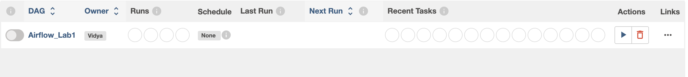
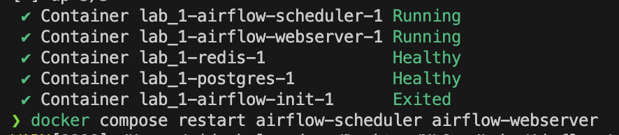

Airflow Lab 1 – KMeans Clustering Pipeline (Modified Version)

Overview

This lab implements an Apache Airflow pipeline that performs end-to-end KMeans clustering using the Elbow method to determine the optimal number of clusters.

The workflow is orchestrated as a Directed Acyclic Graph (DAG) with the following stages:
	1.	Load dataset
	2.	Preprocess data
	3.	Train KMeans models across multiple k values
	4.	Select optimal k using the Elbow method
	5.	Save trained model and clustering artifacts

This version of the lab includes modifications beyond the original starter template.

⸻

Modifications Made 

The following changes were implemented to ensure the lab is not identical to the base repository:

1. Dataset Change

The default dataset was replaced with the Mall Customers dataset, which contains customer demographic and spending features suitable for clustering.

Features include:
	•	Gender
	•	Age
	•	Annual Income (k$)
	•	Spending Score (1–100)

2. Data Cleaning Improvements

The pipeline now:
	•	Removes ID columns (CustomerID)
	•	Encodes Gender as numeric (Male=1, Female=0)
	•	Automatically selects numeric columns for clustering
	•	Fills missing values using column means

3. Improved Model Saving

Instead of saving the last trained model, the pipeline:
	•	Trains KMeans for k = 1 to k_max
	•	Uses KneeLocator to determine the optimal number of clusters
	•	Saves the best-performing model

4. Artifact Generation

The pipeline now produces the following artifacts:
	•	dags/model/kmeans_model.pkl
	•	dags/model/scaler.pkl
	•	dags/model/sse_and_k.json
	•	dags/model/metrics.json

These artifacts provide transparency and reproducibility.

⸻

Project Structure

Lab_1/
├── dags/
│   ├── airflow.py          # DAG definition
│   ├── data/
│   │   └── mall_customers.csv
│   ├── model/              # Saved models and artifacts
│   └── src/
│       └── lab.py          # ML pipeline functions
├── docker-compose.yaml
├── setup.sh
└── README.md

⸻

Prerequisites
	•	Docker Desktop installed and running
	•	At least 4GB memory allocated to Docker (8GB recommended)

Required Python packages (installed via Docker):
	•	pandas
	•	scikit-learn
	•	kneed
	•	pickle

⸻

Setup Instructions

Step 1 – Download Docker Compose (if not already present)

curl -LfO 'https://airflow.apache.org/docs/apache-airflow/2.5.1/docker-compose.yaml'

Ensure the compose file includes:

AIRFLOW__CORE__LOAD_EXAMPLES: 'false'
_PIP_ADDITIONAL_REQUIREMENTS: pandas scikit-learn kneed

⸻

Step 2 – Initialize Environment

From the project root:

bash setup.sh

This will:
	•	Remove old containers
	•	Recreate required directories
	•	Generate .env with correct AIRFLOW_UID

⸻

Step 3 – Initialize Airflow Database

docker compose up airflow-init

⸻

Step 4 – Start Airflow

docker compose up

Wait until you see:

GET /health HTTP/1.1" 200

⸻

Step 5 – Access Web UI

Navigate to:

http://localhost:8080

Default credentials:
	•	Username: airflow
	•	Password: airflow

⸻

DAG Description

DAG Name: your_python_dag (or the updated name in airflow.py)

Schedule: Manual trigger (schedule_interval=None)

Tasks:
	1.	load_data_task
	•	Reads mall_customers.csv
	•	Cleans and encodes dataset
	•	Serializes data using base64 + pickle
	2.	data_preprocessing_task
	•	Handles missing values
	•	Applies MinMax scaling
	•	Serializes numpy array
	3.	build_save_model_task
	•	Trains KMeans models for k=1..k_max
	•	Computes SSE values
	•	Determines optimal k using Elbow method
	•	Saves best model
	4.	load_model_task
	•	Loads saved model
	•	Generates cluster labels
	•	Writes metrics.json

Task flow:

load_data_task 
    >> data_preprocessing_task 
    >> build_save_model_task 
    >> load_model_task

⸻

Running the Pipeline
	1.	Enable DAG in UI
	2.	Click “Trigger DAG”
	3.	Monitor execution in Graph View or Logs

Execution time:
	•	First Docker build: 5–10 minutes
	•	Subsequent runs: ~30 seconds
	•	DAG runtime: 5–20 seconds

⸻

Outputs

After successful execution:

ls dags/model

Expected files:
	•	kmeans_model.pkl
	•	scaler.pkl
	•	sse_and_k.json
	•	metrics.json

Example metrics.json:

{
  "optimal_k_elbow": 5,
  "model_n_clusters": 5,
  "num_rows_labeled": 200,
  "label_counts": {
    "0": 40,
    "1": 45,
    "2": 35,
    "3": 40,
    "4": 40
  }
}

⸻

How to Stop Airflow

docker compose down

⸻

Summary

This project demonstrates:
	•	Containerized ML workflow orchestration
	•	Data preprocessing automation
	•	Model selection using Elbow method
	•	Artifact tracking and reproducibility
	•	Airflow DAG task dependencies
	•	CeleryExecutor configuration

The pipeline is modular, reproducible, and production-style in structure.

